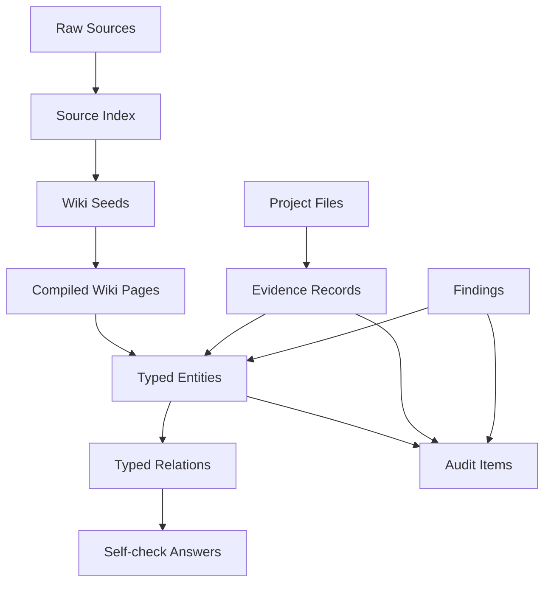

# R_U_OK Data Model

版本：v0.3

## 1. 数据层级

## 2. StandardIndex

文件：`src/data/standard-index.json`

字段：

- `generatedAt`
- `sourceRoot`
- `strategy`
- `copyrightBoundary`
- `totalDocuments`
- `domains`
- `requirementSignals`
- `documents`

### StandardDocument

字段：

- `id`
- `fileName`
- `sourcePath`
- `hash`
- `title`
- `language`
- `sizeKb`
- `headingCount`
- `topHeadings`
- `domains`
- `requirementSignals`
- `candidateEntities`
- `reviewPrompts`
- `readinessScore`
- `wikiSeed`

说明：

- `hash` 用于检测来源文件变更。
- `topHeadings` 是章节信号，不是标准正文副本。
- `candidateEntities` 只能表示中性的条款、义务、主题、控制或记录要求；基础标准索引不得直接生成项目风险或缺口结论。
- `readinessScore` 用于排序，不是合规评分。
- `wikiSeed` 指向建议编译路径。

## 3. KnowledgeBase

文件：`src/data/knowledge-base.json`

字段：

- `version`
- `workspace`
- `sources`
- `projectFiles`
- `evidenceRecords`
- `entities`
- `relations`
- `findings`
- `auditItems`
- `wikiPages`

## 4. ProjectFile

字段：

- `id`
- `name`
- `path`
- `kind`
- `function`
- `status`
- `linkedEvidence`

## 5. EvidenceRecord

字段：

- `id`
- `title`
- `sourceFile`
- `evidenceType`
- `coverage`
- `confidence`
- `summary`
- `linkedEntities`
- `gaps`
- `suggestedActions`

说明：

- `coverage` 表示证据链覆盖状态，不是合规结论。
- `confidence` 表示当前 evidence record 的资料完整度信号。
- `linkedEntities` 用于连接要求、控制、证据和项目缺口。

## 6. Entity

通用字段：

- `id`
- `type`
- `title`
- `summary`
- `severity`
- `sourceRefs`

类型：

- `clause`
- `obligation`
- `gap`
- `control`
- `evidence`

边界：

- `clause`、`obligation`、`control`、`evidence` 可来自基础库或项目工作区。
- `gap` 只能来自项目证据、finding 或人工标注，不应由法规/标准基础库直接推出。

## 7. Relation

字段：

- `id`
- `from`
- `to`
- `type`

关系类型：

- `creates_obligation`
- `identifies_evidence_need`
- `satisfied_by`
- `addresses_gap`
- `reveals_gap`
- `drives_audit_item`
- `checks_control`

## 8. Finding

字段：

- `id`
- `findingType`
- `sourceFunction`
- `sourceEvent`
- `findingDate`
- `status`
- `description`
- `relatedGaps`
- `relatedControls`
- `affectedFunctions`
- `recurrenceSignal`
- `evidenceRefs`
- `owner`
- `dueDate`

## 9. AuditItem

字段：

- `id`
- `auditCycle`
- `auditScope`
- `priority`
- `status`
- `rationale`
- `targetFunctions`
- `sourceFindings`
- `sourceGaps`
- `sourceControls`
- `sourceClauses`
- `suggestedChecks`
- `evidenceNeeded`
- `owner`
- `dueDate`

## 10. 数据隔离原则

- 基础库为只读。
- 项目工作区独立保存。
- 真实项目资料不写入公开 demo 数据。
- 标准索引仅保存元数据和派生信号。
