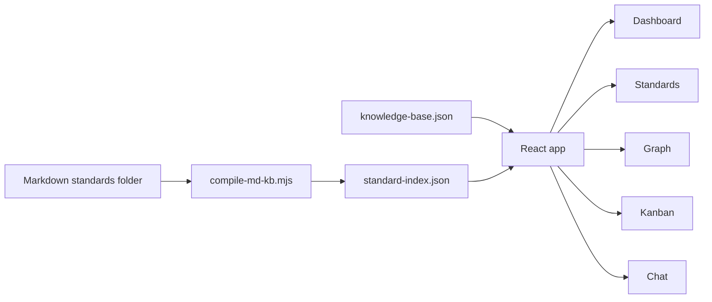
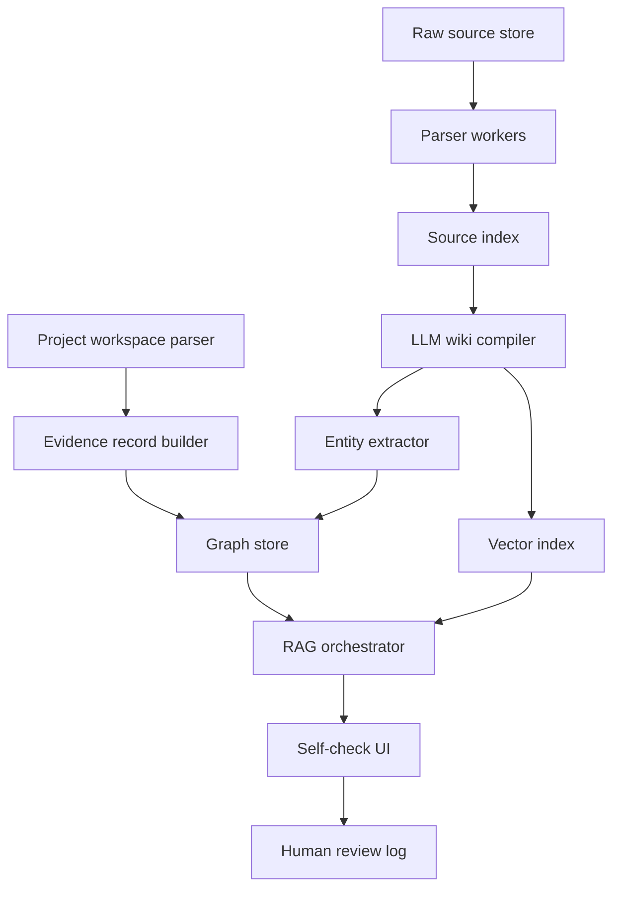

# R_U_OK Technical Design

版本：v0.3

## 1. 当前架构



当前技术栈：

- Vite
- React
- TypeScript
- JSON data files
- Node.js scripts

## 2. 本地运行

```bash
npm install
npm run kb:compile
npm run dev
```

## 3. 构建与校验

```bash
npm run lint:standards
npm run lint:schema
npm run build
```

## 4. 知识库编译器

脚本：`scripts/compile-md-kb.mjs`

输入：

- Markdown 标准目录。

输出：

- `src/data/standard-index.json`

处理：

- 遍历 Markdown。
- 提取标题和章节信号。
- 识别语言。
- 计算 hash。
- 推断 domains。
- 推断 requirementSignals。
- 生成 candidateEntities。
- 生成 reviewPrompts。
- 生成 readinessScore。
- 生成 wikiSeed。

版权边界：

- 不复制大段标准正文。
- 仅保存元数据、标题、章节信号和派生标签。

## 5. 前端应用

入口：

- `src/main.tsx`
- `src/styles.css`

设计原则：

- 单页应用足够支撑 MVP 演示。
- 使用本地 JSON 作为事实源。
- 优先展示业务链路，不引入复杂状态管理。
- 页面围绕 Dashboard、Standards、Graph、Kanban、Chat 五个工作台组织。

## 6. Chat 当前实现

当前 Chat 是规则化本地回答：

- 根据问题选择 audit item。
- 回溯 risks、clauses、controls。
- 匹配 standard requirement signals。
- 输出 sources 和人工复核提示。

后续替换方向：

- Local LLM 或企业模型。
- 向量检索用于候选段落召回。
- 图谱遍历用于实体关系解释。
- Prompt guardrail 控制合规边界。

## 7. 推荐后续架构



建议组件：

- SQLite：本地 structured store。
- LanceDB 或 Chroma：本地向量索引。
- Graph table 或轻量 graph store：实体关系。
- Worker queue：批量编译标准和项目资料。
- Audit log：记录每次回答和人工确认。

## 8. 安全与合规设计

- 默认本地运行。
- 基础库只读。
- 项目资料按 workspace 隔离。
- 所有回答包含人工复核提示。
- 保留 source path、hash、引用 ID。
- 不输出最终合规结论。

## 9. 技术债

- 当前数据在 JSON 文件中，适合 demo，不适合多人协作。
- 当前 graph 是静态布局，后续需要真实图布局引擎。
- 当前 Chat 是规则匹配，后续需要 RAG/LLM。
- 当前 Markdown 解析主要依靠标题和关键词，后续需要结构化条款解析。
- 当前 evidence records 是样例数据，后续需要真实本地文件解析和人工确认工作流。
